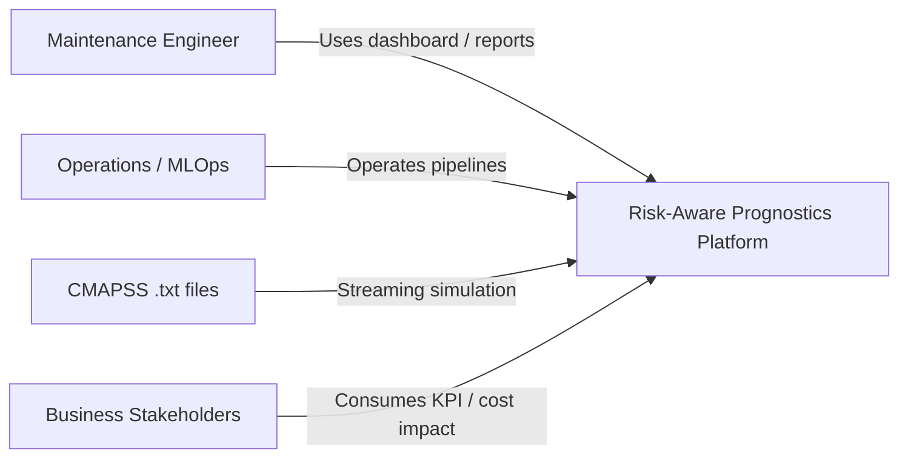
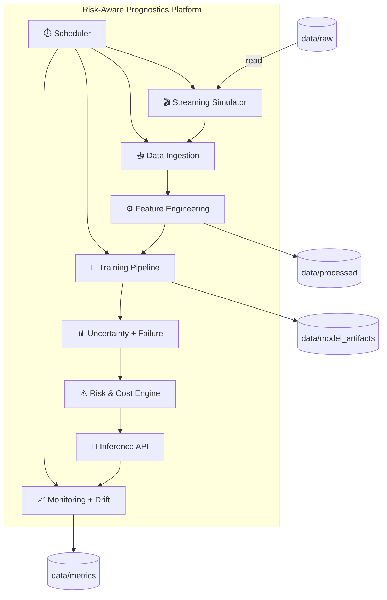
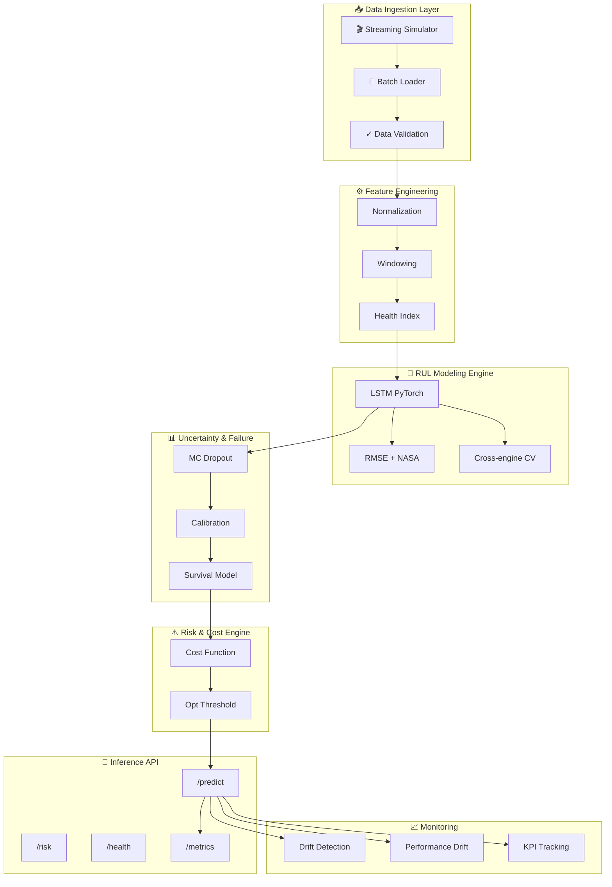

# Risk-Aware Prognostics & Decision Platform  
## High-Level Architecture Design

---

# 1. System Vision

This platform is designed as an end-to-end AI lifecycle architecture for safety-critical predictive maintenance systems.

It transforms raw degradation signals into:

- Remaining Useful Life (RUL) estimates
- Uncertainty-aware failure probabilities
- Risk-adjusted maintenance decisions
- Economic optimization outputs

The system is modular, production-oriented, and designed for extensibility across aerospace, automotive, rail, and energy domains.

---

# 2. Architectural Principles

1. Separation of concerns (data, modeling, decision, monitoring)
2. Risk-aware over accuracy-only design
3. Probabilistic outputs, not deterministic predictions
4. Production-first thinking
5. Reproducibility and version control
6. Decision support over pure ML output

---

# 3. C4 Architecture (Context, Container, Component)

## 3.1 System Context (C4 - Context)

## 3.2 Containers (C4 - Container)

## 3.3 Components (C4 - Component)

## 3.4 MVP vs Target Scope

- **MVP**: Simulator, Ingestion, Feature Engineering, LSTM baseline, RMSE/NASA, MC Dropout, Risk & Cost Engine, FastAPI, Docker Compose, basic monitoring.
- **Target**: Ensemble models, advanced failure modeling, full KPI dashboard, automated retraining triggers, richer drift monitoring.

---

# 4. Component Breakdown

## 4.1 Digital Degradation Simulator

Purpose:
- Simulate engine degradation lifecycle
- Inject controlled noise and drift
- Emulate new operational regimes

Inputs:
- Historical degradation data
- Noise parameters
- Drift parameters

Outputs:
- Simulated streaming sensor data

---

## 4.2 Data Ingestion Layer

Responsibilities:
- Streaming simulation
- Batch ingestion (training)
- Data validation
- Schema enforcement

Design:
- Modular loader
- Config-driven ingestion
- Reproducible data pipelines

---

## 4.3 Feature Engineering Layer

Responsibilities:
- Sensor normalization
- Rolling window construction
- Health index computation
- Feature selection

Design goal:
Maintain interpretability and traceability of derived features.

---

## 4.4 RUL Modeling Engine

Responsibilities:
- Train multiple architectures
- Cross-engine validation
- Evaluate with RMSE and NASA scoring function

Models:
- LSTM baseline
- Temporal CNN
- Attention-based model
- Ensemble aggregation

Output:
- Deterministic RUL estimate

---

## 4.5 Uncertainty Quantification Layer

Responsibilities:
- Estimate predictive uncertainty
- Generate prediction intervals
- Perform calibration analysis

Methods:
- MC Dropout
- Reliability diagrams
- Expected calibration error

Output:
- RUL mean
- Confidence interval
- Uncertainty score

---

## 4.6 Probabilistic Failure Modeling

Purpose:
Convert RUL + uncertainty into failure probability.

Outputs:
- P(failure ≤ N cycles)
- Hazard rate estimate
- Survival curve

Optional extension:
- Weibull-based survival modeling

---

## 4.7 Risk-Aware Decision Engine

Core decision module.

Inputs:
- Failure probability
- Uncertainty
- Risk tolerance threshold

Outputs:
- Risk score
- Maintenance urgency classification
- Recommended intervention window

Key concept:
Minimize risk exposure, not prediction error.

---

## 4.8 Economic Optimization Layer

Purpose:
Transform technical outputs into financial decisions.

Parameters:
- Cost of early maintenance (C_early)
- Cost of late failure (C_late)
- Downtime impact

Optimization:
Minimize expected total maintenance cost:

E(Cost) = P(late) * C_late + P(early) * C_early

Outputs:
- Optimal intervention threshold
- Cost sensitivity analysis
- Expected annual savings

---

## 4.9 Inference API

Responsibilities:
- Serve real-time predictions
- Provide health check endpoint
- Return RUL, uncertainty, risk score, cost recommendation

Technology:
- FastAPI
- Dockerized container

Endpoints:
- /predict
- /risk
- /health
- /metrics

---

## 4.10 Monitoring & Drift Module

Responsibilities:
- Data drift detection
- Performance degradation monitoring
- Retraining trigger logic
- Model version tracking

Metrics:
- Feature distribution shift
- RUL error drift
- Calibration degradation

---

# 5. Non-Functional Requirements

- Modular and extensible
- Reproducible training
- Version-controlled models
- Containerized deployment
- Clear audit trail
- Documented architectural decisions

---

# 6. Deployment Overview

Deployment strategy:

- Docker container for API
- Separate container for monitoring
- Docker Compose for local orchestration
- Configurable environment variables

Future extensibility:
- Kubernetes adaptation
- Cloud deployment compatibility

---

# 7. Design Trade-Offs

1. Simplicity vs performance  
2. Interpretability vs deep complexity  
3. Deterministic vs probabilistic modeling  
4. Static threshold vs cost-optimized dynamic policy  

These trade-offs are explicitly documented in ADR files.

---

# 8. System Positioning

This architecture is not designed as a Kaggle solution.

It is designed as:

A production-oriented, risk-aware AI decision platform for safety-critical predictive maintenance environments.
